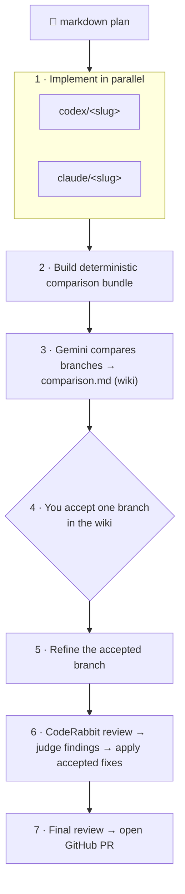

# diamond-dev

[](https://pypi.org/project/diamond-dev/)
[](https://github.com/hbmartin/diamond-dev/actions/workflows/ci.yml)
[](https://github.com/astral-sh/ruff)
[](https://www.python.org/downloads/)
[](https://github.com/astral-sh/ty)
[](https://deepwiki.com/hbmartin/diamond-dev)

**Run one plan through competing coding agents, pick the winner, ship a PR.**

`diamond-dev` takes a single markdown plan and hands it to two coding agents at
once (by default Codex and Claude), each working on its own branch. A judge agent
(Gemini) compares the results, you accept one branch with a single checkbox, and
`diamond-dev` then refines it, runs a CodeRabbit review, applies the accepted
fixes, and opens a GitHub PR.

The name traces the shape of the run: it **fans out** from one plan to many
parallel implementations, then **converges** back in — through the judge's
comparison and your acceptance — to a single PR. Out, then in: a diamond.

## Workflow



1. **Implement** — each configured implementer (default `codex`, `claude`)
   implements the plan on its own branch and commits without pushing.
2. **Bundle** — `diamond-dev` builds a deterministic comparison bundle (branch
   metadata, diffs, optional test results) for the judge to read.
3. **Compare** — the comparison judge (default `gemini`) writes `comparison.md`,
   which is pushed to the GitHub wiki with an acceptance checkbox.
4. **Accept** — you check exactly one box in the wiki to choose a branch. The
   workflow polls the wiki and resumes when it sees your choice.
5. **Refine** — the accepted branch is refined per the comparison follow-up.
6. **Review** — CodeRabbit reviews the branch, the review judge classifies each
   finding, and the review fixer applies accepted fixes.
7. **PR** — a final reviewer runs and `diamond-dev` opens a GitHub PR.

> ⚠️ **Security:** `diamond-dev` runs coding agents with their sandbox and
> approval prompts disabled, and executes package-install and test commands from
> the target repository. Run it only against repositories and plans you trust.
> See [Security](#security).

## Table of Contents

**Getting started**

- [Prerequisites](#prerequisites)
- [Installation](#installation)
- [Quickstart](#quickstart)
- [Usage](#usage)
- [Configuration](#configuration)

**Reference**

- [Documentation](#documentation)
- [Security](#security)
- [Troubleshooting & FAQ](#troubleshooting--faq)
- [License](#license)

## Prerequisites

- **Python 3.14+**
- **External CLIs**, installed and authenticated where needed. The default
  workflow needs:
  - `git`
  - `gh` (authenticated — `diamond-dev` verifies `gh auth status` at startup)
  - `codex`
  - `claude`
  - `gemini`
  - `coderabbit`
- **Optional CLIs**, required only when the cloned target repository has matching
  root lockfiles:
  - `uv` — for `uv.lock` (`uv sync --locked`)
  - `pnpm` — for `pnpm-lock.yaml` (`pnpm install --frozen-lockfile`)

Before cloning or launching agents, `diamond-dev` runs doctor-grade preflight
checks that verify the configured commands are available on `PATH`, GitHub auth
works, each configured agent adapter is logged in, local workspace and wiki
directories are writable, and the wiki remote accepts a dry-run push. When you
use custom agents, only the CLIs for the adapters you configure are required.

## Installation

`diamond-dev` targets Python 3.14+. The recommended installer is
[`uv`](https://docs.astral.sh/uv/).

Install the CLI directly from the repository:

```bash
uv tool install git+https://github.com/hbmartin/diamond-dev.git
```

Or clone and install from source for development:

```bash
git clone https://github.com/hbmartin/diamond-dev.git
cd diamond-dev
uv sync --all-groups
uv run diamond-dev --version
```

## Quickstart

```bash
# 1. Generate a starter config in your working directory.
diamond-dev init

# 2. Check CLI auth, wiki push access, and local write permissions.
diamond-dev doctor

# 3. Write a plan describing the change you want.
$EDITOR my-plan.md

# 4. Run the workflow.
diamond-dev my-plan.md
```

`init` asks for the target repository URL, an optional wiki repository URL, and
optional notification URLs, then writes `.diamond-dev.toml`. Everything else uses
the defaults described under [Configuration](#configuration).

When the run reaches step 3 of the workflow, it **pauses for your input**. Open
the comparison page in the repository's GitHub wiki (`<slug>-comparison.md`),
read Gemini's comparison of the two branches, and check exactly one box:

```markdown
- [x] Accept: codex
```

`diamond-dev` polls the wiki, sees your choice, and resumes automatically —
refining the accepted branch, running the review, and opening the PR. You do not
need to restart the command; if it has exited, rerunning `diamond-dev my-plan.md`
auto-resumes from where it left off (see
[Repositories & auto-resume](docs/repositories-and-resume.md)).

## Usage

```bash
diamond-dev path/to/my-plan.md
```

The command must be run from a directory containing `.diamond-dev.toml` (or pass
`--config`). It takes a path to a `.md` plan file.

The plan file name is copied into generated repositories and wiki artifacts, so
its basename must be a direct, cross-platform file name: no path separators,
leading dash, trailing dot or space, control characters, Windows-reserved
characters, or Windows device names such as `CON` or `NUL.txt`.

To compare two existing commits instead of starting from a plan, pass exactly two
commit-ish refs:

```bash
diamond-dev abc123 def456
```

This skips the implementation agents and compares the two commits through the same
acceptance, review, and PR flow. See
[Two-commit mode](docs/two-commit-mode.md) for ref resolution and naming rules.

To create a starter config interactively:

```bash
diamond-dev init
```

The initializer asks for the target repository URL, an optional wiki repository
URL, and optional notification URLs. It writes only `.diamond-dev.toml`; workflow,
agent, prompt, and comparison settings use the defaults documented under
[Configuration](#configuration) unless you edit the generated file.

Useful flags:

- `--config PATH`: Load configuration from a specific TOML file instead of
  `.diamond-dev.toml` in the current directory. Relative paths resolve from the
  invocation directory. With `init`, this selects the config file to write.
- `--force`: With `init`, overwrite an existing config file without asking.
- `--version`: Show the installed `diamond-dev` version.

To run readiness checks without starting a workflow:

```bash
diamond-dev doctor
diamond-dev --config custom.toml doctor
```

`doctor` runs the same startup checks used by workflow preflight. Codex, Claude,
and CodeRabbit use their auth status commands. Gemini does not expose a status
command, so `doctor` sends a tiny headless prompt to validate Gemini auth before
long-running agents start.

## Configuration

`diamond-dev` reads `.diamond-dev.toml` from the invocation directory (or the
path passed to `--config`). Only one key is required — the target repository —
so the smallest working config is a single line:

```toml
repository_url = "git@github.com:owner/repo.git"
```

`repository_url` must be a Git remote URL in a supported form such as
`https://github.com/owner/repo`, `ssh://git@github.com/owner/repo.git`, or an
SCP-like form such as `git@github.com:owner/repo.git`. With only this key,
`diamond-dev` uses the default implementers, judge, prompts, and comparison
settings.

Everything else is optional and has a default. For the complete set of tables and
keys — `[workflow]`, `[agents.*]`, `[comparison]`, `[acceptance]`,
`[notifications]`, `[prompts]`, and legacy/migration notes — see the
[Configuration reference](docs/configuration.md).

## Documentation

The [`docs/`](docs/README.md) directory holds focused guides for everything beyond
the getting-started path:

- **Understand** — [Architecture](docs/architecture.md): the phases, modules, and
  data structures behind a run.
- **Configure & customize** — [Configuration reference](docs/configuration.md),
  [Agents & custom adapters](docs/agents.md),
  [Custom prompts](docs/custom-prompts.md).
- **Reference** — [Two-commit mode](docs/two-commit-mode.md),
  [Repositories & auto-resume](docs/repositories-and-resume.md),
  [Acceptance & review artifacts](docs/acceptance-and-review.md).
- **Operate** — [Automation & CI integration](docs/automation-and-ci.md),
  [Observability](docs/observability.md),
  [Troubleshooting](docs/troubleshooting.md).

## Security

`diamond-dev` executes code on your machine from two untrusted-by-default
sources — the coding agents and the target repository — so run it **only against
repositories and plans you trust**:

- **Agents run with sandbox and approval prompts disabled.** Implementers are
  launched non-interactively with full edit permissions:
  `codex exec --dangerously-bypass-approvals-and-sandbox`,
  `claude -p --permission-mode bypassPermissions --dangerously-skip-permissions`,
  and `gemini -p … --skip-trust -y`. The agents can read and write files and run
  commands in their clones without prompting.
- **Package install runs repository lifecycle scripts.** When a clone contains
  `uv.lock` or `pnpm-lock.yaml`, `diamond-dev` runs the matching install command,
  which can execute dependency lifecycle scripts defined by the target
  repository.
- **Comparison test commands are trusted and run via `sh -lc`.** Any
  `[comparison].test_commands` you configure run in each implementation clone.
- **Logs may contain secrets.** Loguru exception logs include local variable
  values by default. Set `DIAMOND_DEV_LOG_DIAGNOSE=0` (or `false`/`no`/`off`) to
  disable this if your logs may capture sensitive values. See
  [Observability](docs/observability.md).

## Troubleshooting & FAQ

**Preflight fails with a missing command.** The named CLI is not on `PATH`.
Install it (see [Prerequisites](#prerequisites)) or, if you don't use it, remove
the corresponding agent from `[workflow]`. Only the CLIs for configured adapters
are checked.

**Preflight fails on `gh auth status`.** Authenticate the GitHub CLI with
`gh auth login` (or set `GH_TOKEN`) before running.

**The run exited while waiting for acceptance.** That's fine. Edit the acceptance
checkbox in the wiki, then rerun `diamond-dev my-plan.md`; it auto-resumes and
picks up your choice. Pressing Ctrl-C during acceptance polling exits with code
130 after writing the current run report.

**Where are the artifacts?** Comparison bundle, comparison page, review file, and
review-judgment sidecar are written in the invocation directory and pushed to the
GitHub wiki. Per-run logs and `run-report.json` are under `logs/`.

For deeper recovery — plan drift, divergent branches, `succeeded_with_warnings`,
existing PRs on resume, dirty files, and finding the right log — see the
[Troubleshooting guide](docs/troubleshooting.md).

## License

`diamond-dev` is (C) 2026 Harold Martin and licensed under the Apache License, Version 2.0. See [LICENSE](LICENSE) for details.
