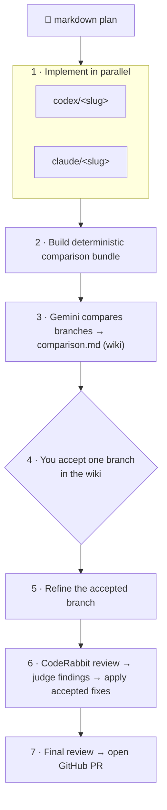

# diamond-dev

[](https://pypi.org/project/diamond-dev/)
[](https://github.com/hbmartin/diamond-dev/actions/workflows/ci.yml)
[](https://github.com/astral-sh/ruff)
[](https://www.python.org/downloads/)
[](https://github.com/astral-sh/ty)
[](https://deepwiki.com/hbmartin/diamond-dev)

**Run one plan through competing coding agents, pick the winner, ship a PR.**

`diamond-dev` takes a single markdown plan and hands it to two coding agents at
once (by default Codex and Claude), each working on its own branch. A judge agent
(Gemini) compares the results, you accept one branch with a single checkbox, and
`diamond-dev` then refines it, runs a CodeRabbit review, applies the accepted
fixes, and opens a GitHub PR.

The name traces the shape of the run: it **fans out** from one plan to many
parallel implementations, then **converges** back in — through the judge's
comparison and your acceptance — to a single PR. Out, then in: a diamond.

## Workflow



1. **Implement** — each configured implementer (default `codex`, `claude`)
   implements the plan on its own branch and commits without pushing.
2. **Bundle** — `diamond-dev` builds a deterministic comparison bundle (branch
   metadata, diffs, optional test results) for the judge to read.
3. **Compare** — the comparison judge (default `gemini`) writes `comparison.md`,
   which is pushed to the GitHub wiki with an acceptance checkbox.
4. **Accept** — you check exactly one box in the wiki to choose a branch. The
   workflow polls the wiki and resumes when it sees your choice.
5. **Refine** — the accepted branch is refined per the comparison follow-up.
6. **Review** — CodeRabbit reviews the branch, the review judge classifies each
   finding, and the review fixer applies accepted fixes.
7. **PR** — a final reviewer runs and `diamond-dev` opens a GitHub PR.

> ⚠️ **Security:** `diamond-dev` runs coding agents with their sandbox and
> approval prompts disabled, and executes package-install and test commands from
> the target repository. Run it only against repositories and plans you trust.
> See [Security](#security).

## Table of Contents

**Getting started**

- [Prerequisites](#prerequisites)
- [Installation](#installation)
- [Quickstart](#quickstart)
- [Usage](#usage)
- [Configuration](#configuration)

**Reference**

- [Prompts](#prompts)
- [Generated Repositories](#generated-repositories)
- [Auto-Resume](#auto-resume)
- [Acceptance & Review Judgments](#acceptance--review-judgments)
- [Security](#security)
- [Logging](#logging)
- [Troubleshooting & FAQ](#troubleshooting--faq)

- [License](#license)

## Prerequisites

- **Python 3.14+**
- **External CLIs**, installed and authenticated where needed. The default
  workflow needs:
  - `git`
  - `gh` (authenticated — `diamond-dev` verifies `gh auth status` at startup)
  - `codex`
  - `claude`
  - `gemini`
  - `coderabbit`
- **Optional CLIs**, required only when the cloned target repository has matching
  root lockfiles:
  - `uv` — for `uv.lock` (`uv sync --locked`)
  - `pnpm` — for `pnpm-lock.yaml` (`pnpm install --frozen-lockfile`)

Before cloning or launching agents, `diamond-dev` runs doctor-grade preflight
checks that verify the configured commands are available on `PATH`, GitHub auth
works, each configured agent adapter is logged in, local workspace and wiki
directories are writable, and the wiki remote accepts a dry-run push. When you
use custom agents, only the CLIs for the adapters you configure are required.

## Installation

`diamond-dev` targets Python 3.14+. The recommended installer is
[`uv`](https://docs.astral.sh/uv/).

Install the CLI directly from the repository:

```bash
uv tool install git+https://github.com/hbmartin/diamond-dev.git
```

Or clone and install from source for development:

```bash
git clone https://github.com/hbmartin/diamond-dev.git
cd diamond-dev
uv sync --all-groups
uv run diamond-dev --version
```

## Quickstart

```bash
# 1. Generate a starter config in your working directory.
diamond-dev init

# 2. Check CLI auth, wiki push access, and local write permissions.
diamond-dev doctor

# 3. Write a plan describing the change you want.
$EDITOR my-plan.md

# 4. Run the workflow.
diamond-dev my-plan.md
```

`init` asks for the target repository URL, an optional wiki repository URL, and
optional notification URLs, then writes `.diamond-dev.toml`. Everything else uses
the defaults described under [Configuration](#configuration).

When the run reaches step 3 of the workflow, it **pauses for your input**. Open
the comparison page in the repository's GitHub wiki (`<slug>-comparison.md`),
read Gemini's comparison of the two branches, and check exactly one box:

```markdown
- [x] Accept: codex
```

`diamond-dev` polls the wiki, sees your choice, and resumes automatically —
refining the accepted branch, running the review, and opening the PR. You do not
need to restart the command; if it has exited, rerunning `diamond-dev my-plan.md`
[auto-resumes](#auto-resume) from where it left off.

## Usage

```bash
diamond-dev path/to/my-plan.md
```

The command must be run from a directory containing `.diamond-dev.toml` (or pass
`--config`). It takes a path to a `.md` plan file.

To compare two existing commits instead of starting from a plan, pass exactly two
commit-ish refs:

```bash
diamond-dev abc123 def456
diamond-dev codex/feature claude/feature
```

Two-commit mode accepts SHAs, short SHAs, branches, tags, and remote refs. It
skips the initial implementation agents, builds the comparison bundle for those
two inputs, writes the comparison page to the wiki, waits for the same
acceptance checkbox, applies follow-up changes to the accepted branch, runs
review, and opens a PR. The PR title is `Compare <selected branch>`.

The two commits are resolved from `repository_url` first. If a commit is
local-only, `diamond-dev` fetches it from the invocation repository only when
that repository's `origin` URL exactly matches `repository_url`; otherwise the
run fails before comparison. The two arguments must resolve to different full
SHAs.

To create a starter config interactively:

```bash
diamond-dev init
```

The initializer asks for the target repository URL, an optional wiki repository
URL, and optional notification URLs. It writes only `.diamond-dev.toml`; workflow,
agent, prompt, and comparison settings use the defaults documented below unless
you edit the generated file.

Useful flags:

- `--config PATH`: Load configuration from a specific TOML file instead of
  `.diamond-dev.toml` in the current directory. Relative paths resolve from the
  invocation directory. With `init`, this selects the config file to write.
- `--force`: With `init`, overwrite an existing config file without asking.
- `--version`: Show the installed `diamond-dev` version.

To run readiness checks without starting a workflow:

```bash
diamond-dev doctor
diamond-dev --config custom.toml doctor
```

`doctor` runs the same startup checks used by workflow preflight. Codex, Claude,
and CodeRabbit use their auth status commands. Gemini does not expose a status
command, so `doctor` sends a tiny headless prompt to validate Gemini auth before
long-running agents start.

## Configuration

`diamond-dev` reads `.diamond-dev.toml` from the invocation directory (or the
path passed to `--config`). Only one key is required; everything else has a
default, so most projects need just a few lines.

### Minimal configuration

The smallest working config is a single line — the target repository:

```toml
repository_url = "git@github.com:owner/repo.git"
```

`repository_url` must be a Git remote URL in a supported form such as
`https://github.com/owner/repo`, `ssh://git@github.com/owner/repo.git`,
`git://host/owner/repo.git`, `file:///path/to/repo.git`, or an SCP-like form
such as `git@github.com:owner/repo.git`. With only this key, `diamond-dev` uses
the default implementers, judge, prompts, and comparison settings described
below.

### Full configuration

The complete set of tables and keys is shown below. Everything outside
`repository_url` is optional — add only the tables you want to change. The
`[workflow]`, `[comparison]`, and `[acceptance]` values shown are the built-in
defaults; the `[notifications]`, `[prompts]`, and `[agents]` entries are
illustrative examples.

`wiki_repository_url` (optional, top-level): GitHub Gollum wiki repository URL.
If omitted, GitHub remotes are derived as `<repo>.wiki.git`. The local wiki clone
directory is named from the effective wiki repository URL.

```toml
repository_url = "git@github.com:owner/repo.git"
# wiki_repository_url = "git@github.com:owner/repo.wiki.git"

[notifications]
initial_implementation_url = "https://example.test/initial"
comparison_url = "https://example.test/comparison"
comparison_implementation_url = "https://example.test/followup"
review_input_needed_url = "https://example.test/review"
open_pr_url = "https://example.test/open-pr"

[prompts]
initial_implementation_file = "prompts/initial.md"
comparison_judgment_file = "prompts/compare.md"
comparison_implementation_file = "prompts/followup.md"
review_judgment_file = "prompts/review-judgment.md"
review_fix_file = "prompts/review-fixes.md"

[workflow]
implementers = ["codex", "claude"]
comparison_judge = "gemini"
# comparison_fixer is optional; omitted means the first non-selected implementer.
review_provider = "coderabbit"
review_judge = "codex"
review_fixer = "codex"
final_reviewer = "claude"

[comparison]
test_commands = []
max_total_diff_bytes = 200000
max_file_diff_bytes = 40000
max_test_output_bytes = 20000

[acceptance]
poll_interval_seconds = 120
max_wait_seconds = 4620

[agents.codex]
model = "gpt-5"

[agents.claude]
model = "opus"

[agents.gemini]
model = "gemini-3"

[agents.claude-fixer]
adapter = "claude"
model = "opus"
```

Prompt file paths resolve from the config file directory. Prompt overrides
replace the built-in task instructions while keeping Diamond Dev's required
workflow context, such as artifact filenames and commit/no-push requirements.

Agent table names are workflow-local agent names. Built-in names such as
`codex`, `claude`, `gemini`, and `coderabbit` implicitly use matching adapters.
Additional agent names must set `adapter` to one of those built-ins, which lets a
workflow use the same CLI in multiple roles with different models.

The `[comparison]` table controls the deterministic comparison bundle generated
before the comparison judge runs. `test_commands` defaults to empty, which
records `tests: not_run` for each implementation branch. When set, commands run
with `sh -lc` in each implementation clone; nonzero exits are recorded in the
bundle and the workflow still continues to comparison judgment. Test commands
are trusted project-specific commands. If they leave uncommitted files,
`diamond-dev` records those dirty files but does not clean them.

Notification URLs are best-effort GET requests. Failures are logged but do not
stop the workflow.

The `[acceptance]` table controls how long the workflow waits for the wiki
acceptance checkbox after the immediate first check. `poll_interval_seconds`
sets the fixed wait between checks, and `max_wait_seconds` caps the total wait
window. The defaults preserve the previous 77-minute total polling window with
a more responsive fixed cadence: one immediate wiki sync followed by 39 delayed
checks, which increases remote fetch/pull load compared with the legacy backoff
schedule.

<details>
<summary>Legacy and removed keys (migration)</summary>

`[prompts].gemini_comparison_file` and the legacy top-level
`gemini_comparison_prompt_file` key are still accepted as aliases for
`[prompts].comparison_judgment_file`.

Legacy top-level notification keys are still accepted:
`notify_initial_implementation_url`, `notify_comparison_url`,
`notify_comparison_implementation_url`, `notify_review_input_needed_url`, and
`notify_open_pr_url`. A config fails if a legacy key and its table replacement
are both present.

The previous `notes_repository_url` key has been removed. Use
`wiki_repository_url`; configs that still contain the old key fail at startup.

</details>

## Reference

Detailed behavior for when you need it — prompt internals, generated
repositories, resume semantics, acceptance and review artifacts, security, and
logging. The Getting Started sections above cover the common path; reach for
these when something surprises you.

## Prompts

Each built-in prompt has a fallback that can be replaced by a configured prompt
file (see the `[prompts]` table); overrides keep the required context wrapper.
The prompt builders live in
[`diamond_dev/commands.py`](diamond_dev/commands.py):

- [`initial_implementation_prompt`](diamond_dev/commands.py#L153): asks each
  configured implementer to implement the plan and commit without pushing.
- [`comparison_implementation_prompt`](diamond_dev/commands.py#L169): asks the
  configured comparison fixer to apply requested follow-up changes from the
  comparison.
- [`review_judgment_prompt`](diamond_dev/commands.py#L187): asks the configured
  review judge to classify review findings and write
  `<slug>-review-judgments.json`.
- [`review_fix_prompt`](diamond_dev/commands.py#L219): asks the configured review
  fixer to implement accepted review fixes, preferring the JSON sidecar when
  valid and falling back to legacy markdown judgments when it is absent or
  malformed.
- [`gemini_comparison_prompt`](diamond_dev/commands.py#L247): adds required
  branch, repository, and output-file context to the comparison judge prompt.
- [`_fallback_prompt`](diamond_dev/commands.py#L259): the built-in comparison
  judgment prompt used when `[prompts].comparison_judgment_file` is unset or
  empty.

## Generated Repositories

For a plan named `My Plan.md`, the command uses the slug `my-plan`. With the
default implementers it creates:

- `codex-my-plan` on branch `codex/my-plan`
- `claude-my-plan` on branch `claude/my-plan`
- `<repo-name>.wiki` for the GitHub Gollum wiki

For custom implementers, generated implementation clones and branches use the
same pattern: `<agent-name>-my-plan` on branch `<agent-name>/my-plan`.

In two-commit mode, `diamond-dev` syncs the wiki and searches
`diamond-dev-commit-comparisons.md` plus hidden comparison-page markers for the
ordered SHA pair. If no stored slug exists, Codex is asked to generate a concise
branch-style name from the two commit messages; the result is normalized with
the same slug rules as plan filenames. If naming fails, the fallback slug is
`compare-<short-a>-vs-<short-b>`. If the slug collides with another comparison,
the short SHA pair is appended.

Two-commit clone directories use `<label>-<slug>`, where labels are inferred
from commit messages first, then branch/ref names. `codex` and `claude` labels
are inferred as a pair when possible; otherwise labels fall back to `a` and `b`.
When safe, an input existing branch/ref is used as the workflow branch. If a SHA
maps to a single containing branch, that branch is also used when safe. Duplicate
branch candidates or branches matching the remote base branch fall back to
generated workflow branches named `diamond-dev/<slug>/<label>`. Ambiguous or
unbranched SHAs also use generated branches.

The wiki clone is reused if present and synchronized with fast-forward-only
pulls. On a fresh run, `diamond-dev` clones the implementation repository once,
makes a preserving local copy for the second agent, then checks out each
workflow branch. Implementation clone directories are required on an auto-resume
run.

After each implementation clone is prepared on its workflow branch, `diamond-dev`
checks that clone root for package lockfiles. If `uv.lock` exists, it runs
`uv sync --locked`; if `pnpm-lock.yaml` exists, it runs
`pnpm install --frozen-lockfile`. Repositories with both lockfiles run both
commands in that order in each clone. Repositories with neither lockfile skip
package install. These install commands can execute dependency lifecycle scripts
from the target repository, so run `diamond-dev` only against repositories you
trust (see [Security](#security)).

## Auto-Resume

`diamond-dev` does not write checkpoint files. Rerunning the same plan
automatically resumes from existing local implementation clones, workflow branch
state, wiki artifacts, and PR state.

The source plan file is immutable for resume. Editing the plan after a run starts
causes plan drift failure when the wiki or implementation-clone copy no longer
matches the source. Use a new plan filename/slug, or reset the generated
repositories and wiki artifacts, to start a different plan.

Auto-resume requires every configured implementer clone to exist as a Git
repository with the configured `repository_url` as `origin`. If only some clones
are missing, or workflow branches exist on origin while local clones are
missing, the run fails clearly.

Branch resume rules:

- Remote workflow branches must match the local branch exactly; divergence fails.
- A zero-commit branch counts as complete only when the matching remote branch
  exists and matches local.
- Local commits with no remote branch are pushed instead of rerunning that agent.
- If only one initial agent branch is incomplete, only that agent is rerun.
- The default branch may have advanced; `diamond-dev` does not rebase or merge.

Artifact resume rules:

- If the wiki comparison page exists, it overwrites local `comparison.md`.
- If only local `comparison.md` exists, it is promoted to the wiki with the
  acceptance checkbox added when missing.
- In two-commit mode, local `comparison.md` is reused only when it contains the
  matching ordered commit-pair marker; otherwise it is regenerated.
- The comparison bundle is reused or promoted alongside the comparison page when
  present.
- If only a local review file exists, it is promoted to the wiki.
- If local and wiki review files both exist and differ, the run fails.
- A valid local review judgment sidecar and valid wiki sidecar must match after
  canonical JSON parsing. Missing or malformed sidecars are logged and ignored.
- Existing review files do not skip the configured review fixer; fixes rerun
  when resume reaches the review phase.
- Existing PRs for the selected branch, open, closed, or merged, fail before PR
  creation.
- Notifications are sent only for phases completed by the current process.

## Acceptance & Review Judgments

Before comparison judgment, `diamond-dev` writes
`<slug>-comparison-bundle.md` in the invocation directory and wiki. The bundle
includes branch metadata, changed-file stats, capped file lists and diffs,
configured comparison test results, command log paths, and explicit omitted-file
lists. The configured comparison judge must read that bundle and write
`comparison.md` in the invocation directory. The command then appends this
default line and pushes the file to the GitHub Gollum wiki as
`<slug>-comparison.md`:

```markdown
- [ ] Accept: (codex/claude)
```

The workflow accepts only one of these edited values:

```markdown
- [x] Accept: codex
- [x] Accept: claude
```

With custom implementers, the checkbox and accepted values use the configured
implementer names, for example `- [ ] Accept: (codex/claude/aider)`.

Malformed acceptance markers fail immediately. The command checks once
immediately, then polls every `acceptance.poll_interval_seconds` until
`acceptance.max_wait_seconds` has elapsed.

Review judgment creates a machine-readable sidecar named
`<slug>-review-judgments.json` with `schema_version`, `review_file`,
`review_provider`, `review_judge`, and per-finding `id`, `decision`,
`confidence`, and `rationale`. Valid sidecars are rendered into a deterministic
`Structured review judgments` section in `<slug>-review.md`; the PR body only
includes compact decision counts and any `needs_input` IDs.

## Security

`diamond-dev` executes code on your machine from two untrusted-by-default
sources — the coding agents and the target repository — so run it **only against
repositories and plans you trust**:

- **Agents run with sandbox and approval prompts disabled.** Implementers are
  launched non-interactively with full edit permissions:
  `codex exec --dangerously-bypass-approvals-and-sandbox`,
  `claude -p --permission-mode bypassPermissions --dangerously-skip-permissions`,
  and `gemini -p … --skip-trust -y`. The agents can read and write files and run
  commands in their clones without prompting.
- **Package install runs repository lifecycle scripts.** When a clone contains
  `uv.lock` or `pnpm-lock.yaml`, `diamond-dev` runs the matching install command,
  which can execute dependency lifecycle scripts defined by the target
  repository.
- **Comparison test commands are trusted and run via `sh -lc`.** Any
  `[comparison].test_commands` you configure run in each implementation clone.
- **Logs may contain secrets.** Loguru exception logs include local variable
  values by default. Set `DIAMOND_DEV_LOG_DIAGNOSE=0` (or `false`/`no`/`off`) to
  disable this if your logs may capture sensitive values.

## Logging

`diamond-dev` uses Loguru for console, readable text file, and JSONL file
logging. Logs are written to stderr, `logs/diamond-dev.log`, and
`logs/diamond-dev.jsonl` by default.

Agent subprocess logs are written under `logs/` and streamed through Loguru.
Agents commit their changes; `diamond-dev` pushes committed work. If uncommitted
files remain, they are logged and included in the final PR body.

Each run also writes `logs/run-report.json` and the equivalent `logs/run.json`,
a structured summary containing the run status, chosen agent, branches, PR URL,
dirty-file records, per-phase timings and statuses, non-fatal phase warnings,
preflight details, and per-step command log paths. The report includes
comparison bundle and review judgment sidecar paths, plus the sidecar parse
status. Runs that finish after skipped or failed best-effort phases report
`succeeded_with_warnings` and include those warnings in the PR body.

Configure logging with environment variables:

- `DIAMOND_DEV_LOG_LEVEL`: Log level for console, text file, and JSONL output.
  Defaults to `INFO`.
- `DIAMOND_DEV_LOG_FILE`: File path for readable persistent logs. Defaults to
  `logs/diamond-dev.log`.
- `DIAMOND_DEV_JSON_LOG_FILE`: File path for serialized JSONL logs. Defaults to
  `logs/diamond-dev.jsonl`.
- `DIAMOND_DEV_LOG_DIAGNOSE`: Whether Loguru should include local variable
  values in exception tracebacks. Defaults to enabled. Disable with `0`,
  `false`, `no`, or `off` if logs may contain secrets.

File logs rotate at 10 MB, retain rotated files for 30 days, compress rotated
logs as zip files, use UTF-8 with fallback escaping, and are created with owner
read/write permissions. Exception logs include extended tracebacks. When
OpenTelemetry is installed, log records include the active trace ID, span ID,
sampled flag, and service name; otherwise those fields are present with default
zero or empty values.

Phase start, success, and failure messages include structured JSONL fields such
as `phase`, `phase_status`, and `duration_seconds` for dashboard and CI parsing.

## Troubleshooting & FAQ

**Preflight fails with a missing command.** The named CLI is not on `PATH`.
Install it (see [Prerequisites](#prerequisites)) or, if you don't use it, remove
the corresponding agent from `[workflow]`. Only the CLIs for configured adapters
are checked.

**Preflight fails on `gh auth status`.** Authenticate the GitHub CLI with
`gh auth login` (or set `GH_TOKEN`) before running.

**"Plan drift" failure.** The source plan was edited after a run started, so it no
longer matches the copy stored in the wiki or an implementation clone. The plan
is immutable for resume — start over with a new plan filename/slug, or reset the
generated repositories and wiki artifacts. See [Auto-Resume](#auto-resume).

**The run exited while waiting for acceptance.** That's fine. Edit the acceptance
checkbox in the wiki, then rerun `diamond-dev my-plan.md`; it auto-resumes and
picks up your choice. Pressing Ctrl-C during acceptance polling exits with code
130 after writing the current run report.

**A run finished with `succeeded_with_warnings`.** One or more best-effort phases
(such as a notification or an optional test command) were skipped or failed but
did not block the workflow. The specific warnings are listed in
`logs/run-report.json` and the PR body.

**A PR already exists for the selected branch.** Auto-resume fails before PR
creation if any PR (open, closed, or merged) already exists for the accepted
branch. Resolve or rename the branch, or start a new plan slug.

**Where are the artifacts?** Comparison bundle, comparison page, review file, and
review-judgment sidecar are written in the invocation directory and pushed to the
GitHub wiki. Per-run logs and `run-report.json` are under `logs/`.

## License

`diamond-dev` is (C) 2026 Harold Martin and licensed under the Apache License, Version 2.0. See [LICENSE](LICENSE) for details.
