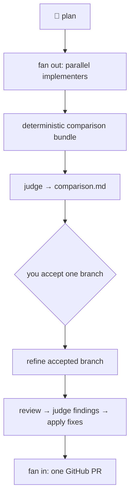

# Architecture

This guide explains how a `diamond-dev` run is structured: the diamond concept, the
phases the orchestrator executes, which module owns each phase, and the core data
structures that thread through them. It is a map for contributors and for anyone
debugging a run against the source. The orchestrator lives in
[`orchestrator.py`](../diamond_dev/orchestrator.py); read the main
[README](../README.md) for the user-facing workflow.

## The diamond

A run **fans out** from a single plan to several parallel implementations, then
**converges** back to one pull request. The narrow points of the diamond are the
two places work re-joins: the judge's comparison, and your single-checkbox
acceptance.

This shape is why each implementer works in its **own clone and branch** with no
pushing until `diamond-dev` pushes committed work, why the comparison input is a
**deterministic bundle** (so the judge reads identical material every run), and why
acceptance is a human gate rather than an automated score.

## Phases

The orchestrator wraps every step in `_timed_phase`, which logs structured
start/end records and appends to the run report's `phase_timings` (see
[Observability](observability.md) and
[Automation & CI integration](automation-and-ci.md)). A plan run
(`DiamondDevOrchestrator.run`) executes these phases in order:

| Phase name | Module / method | Responsibility |
| --- | --- | --- |
| `resolve plan` | `workflow.resolve_plan_path` | Validate the `.md` plan path. |
| `load config` | `config.load_config` | Parse and validate `.diamond-dev.toml`. |
| `build context` | `workflow.build_run_context` | Resolve slug, wiki, clones, branches into a `RunContext`. |
| `preflight` | `preflight.run_preflight` | CLI/auth/wiki/write-permission checks. |
| `prepare wiki` | `RepositoryPreparationMixin._prepare_wiki_with_plan` | Clone/sync the wiki; store the plan copy. |
| `prepare or resume implementation clones` | `RepositoryPreparationMixin._prepare_implementation_clones` | Create or reuse each implementer clone on its branch; run lockfile install. |
| `complete initial agents` | `DiamondDevOrchestrator._run_initial_agents` | Run missing implementers in parallel; push committed work. |
| `prepare comparison` | `ComparisonPhasesMixin._run_comparison_judgment` | Build the bundle, run the judge, publish `comparison.md` with the checkbox. |
| `poll acceptance` | `AcceptancePollingMixin._poll_acceptance` | Poll the wiki for your accepted branch. |
| `run comparison implementation` | `ComparisonPhasesMixin._run_comparison_fixer` | Apply the comparison follow-up to the accepted branch. |
| `run review phases` | `ReviewPhasesMixin._run_review_phases` | Run the review provider, judge findings, apply accepted fixes. |
| `finalize pull request` | `PullRequestFinalizationMixin._finalize_pr` | Run the final reviewer and open the PR. |

Two-commit mode (`run_commits`) replaces the first phases with `resolve commits`,
`resolve commit slug`, and a commit-pair `build context`, skips the initial agents,
and then runs the same shared pipeline from `prepare comparison` onward (see
[Two-commit mode](two-commit-mode.md)). The `doctor` command runs only the
preflight checks.

## Orchestrator composition

`DiamondDevOrchestrator` is assembled from focused mixins, each owning one slice of
the workflow:

- [`orchestrator_repositories.py`](../diamond_dev/orchestrator_repositories.py) —
  `RepositoryPreparationMixin`: wiki and clone preparation, plan-drift checks,
  auto-resume.
- [`orchestrator_comparison.py`](../diamond_dev/orchestrator_comparison.py) —
  `ComparisonPhasesMixin`: comparison bundle, judge, and follow-up fixer.
- [`orchestrator_acceptance.py`](../diamond_dev/orchestrator_acceptance.py) —
  `AcceptancePollingMixin`: wiki acceptance polling.
- [`orchestrator_review.py`](../diamond_dev/orchestrator_review.py) —
  `ReviewPhasesMixin`: review provider, review judgment, review fixes.
- [`orchestrator_pull_request.py`](../diamond_dev/orchestrator_pull_request.py) —
  `PullRequestFinalizationMixin`: final review and PR creation.

Cross-cutting collaborators are injected in `__init__`: a `CommandRunner`
([`executor.py`](../diamond_dev/executor.py)) that logs every external command,
`GitOperations` ([`git_ops.py`](../diamond_dev/git_ops.py)), a
`GitHubWorkflowProvider` and `ReviewProvider`
([`providers.py`](../diamond_dev/providers.py)), and agent command builders
([`orchestrator_agents.py`](../diamond_dev/orchestrator_agents.py),
[`agents.py`](../diamond_dev/agents.py)). See [Agents & custom adapters](agents.md)
for how roles map to CLIs.

## Core data structures

The phases pass an immutable `RunContext` ([`workflow.py`](../diamond_dev/workflow.py));
`with_*` helpers return updated copies rather than mutating in place.

| Type | What it holds |
| --- | --- |
| `RunContext` | The whole run: `cwd`, `config`, `plan`, `wiki`, `implementation`, optional `commit_pair`, accumulated `dirty_records`, and `pr_url`. |
| `PlanContext` | Plan path and `slug`; derives every artifact filename (`<slug>-comparison.md`, `<slug>-review-judgments.json`, …). |
| `WikiContext` | Wiki URL, local directory, and the resolved artifact paths inside it. |
| `ImplementationContext` / `ImplementationBranch` | Per-implementer repo dir, branch, and log prefix, plus the resolved `base_branch`. |
| `CommitPairContext` / `CommitPairEntry` | Two-commit mode: slug, ordered entries, and the stable wiki marker/index lines. |
| `SelectedImplementation` | After acceptance: the accepted agent, the comparison fixer, and the chosen repo/branch. |
| `DirtyRecord` | Uncommitted files an agent left behind, surfaced in the run report and PR body. |

A failed run still produces a report: `_reported_run` records the status
(`succeeded`, `succeeded_with_warnings`, or `failed`), phase timings, warnings, and
command logs even when a phase raises. That report is the primary artifact for
debugging — see [Troubleshooting](troubleshooting.md).
